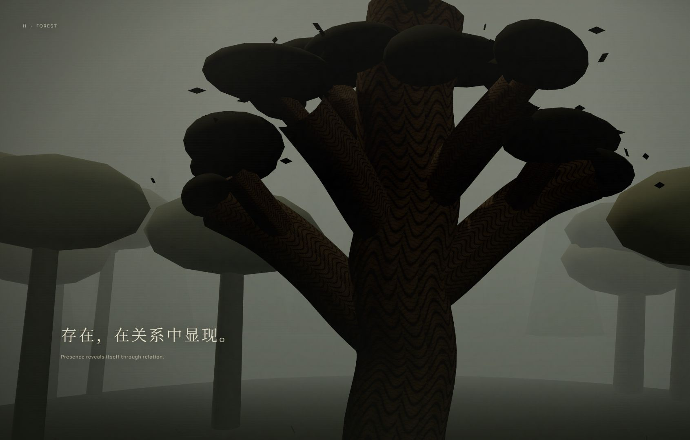
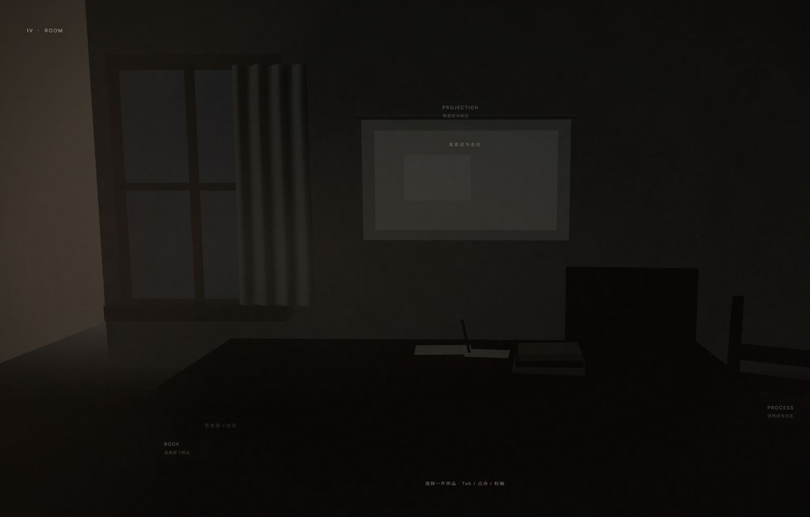
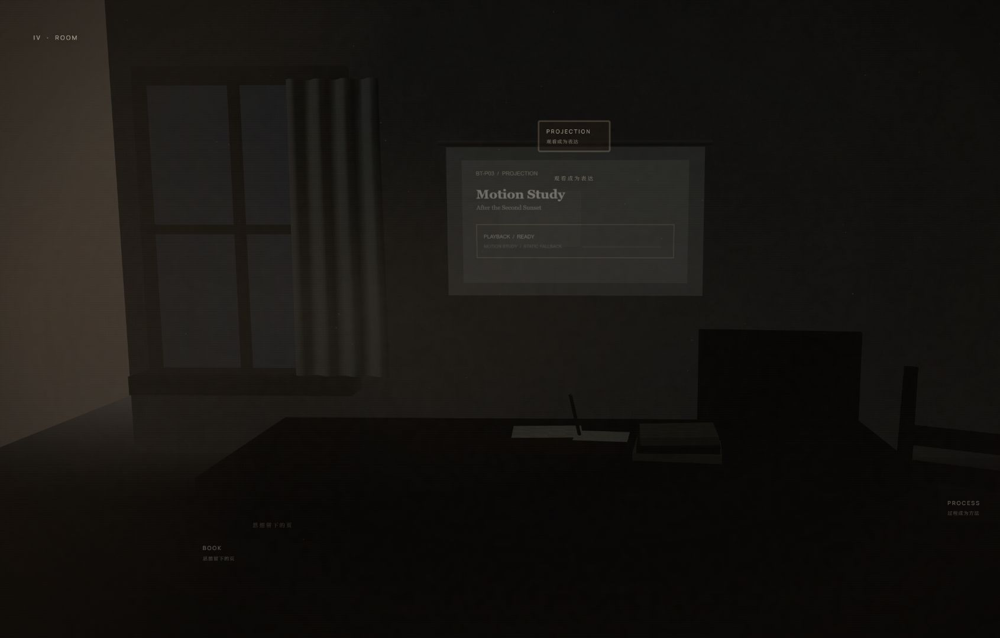

# 不止于此 · Beyond This

一件关于跨领域学习，以及观看与创造如何彼此发生的五幕浏览器交互作品。

[Live experience](https://beyond-this.vercel.app/) · Interactive digital film / web experience



## The work

《不止于此》把滚动、空间、光线与声音组织成一段连续的观看过程。作品不把技术作为展示对象，而把它作为导演节奏、建立关系和引导注意力的创作手段。

五幕从潜在走向显现，再进入生活与回望：

- **Seed** — 未知与创造的起点
- **Forest** — 存在在关系中显现
- **Tree** — 生长、材料与时间的连续性
- **Room** — 作品进入生活，意义继续发生
- **Light** — 重新观看，回到关系本身

核心命题是：学习并非把学科并列堆积，而是在观看、制作与生活之间建立能够继续生长的关系。

## Selected frames

| Room | Book | Projection |
| --- | --- | --- |
|  |  |  |

## BT-P03 in the Room

Room 是五幕中的内容空间。三个入口以同一件跨媒介项目 **BT-P03 / After the Second Sunset** 为中心：

- **Book**：视觉发展册，把材料、构图与判断过程整理成可阅读的页。
- **Process**：方法与迭代的界面化呈现。
- **Projection**：动态影像片段，让观看成为表达的一部分。

## Creative direction

- **Visual system** — 从土壤暗部、森林暖光、木质材料到暮蓝终幕，色彩和光线承担章节叙事。
- **Interaction** — 单一连续时间轴统筹滚轮、触控与键盘；Room 的内容入口保持可逆、可关闭并返回原焦点。
- **Sound** — 无 BGM。Forest 仅使用环境与落叶两层声音，以低权重混合、crossfade 循环和渐变增益进入/退出。
- **Motion** — 章节羽化、镜头阻尼与视觉注意力共同控制节奏；reduced-motion 路径减少动态并保留叙事信息。

## Technical architecture

React 与 TypeScript 管理体验状态、内容注册和可访问交互；Three.js / React Three Fiber 负责实时场景；GSAP 负责局部时间轴。媒体、声音与 Room 内容以独立边界接入，章节控制器保持对正向与反向浏览的一致解释。

**Stack:** React 19, TypeScript, Three.js, React Three Fiber, GSAP, Vite, Vercel.

## Accessibility and devices

作品支持键盘、滚轮与触控；提供声音开关、焦点返回、语义化 Room 导航、reduced-motion 适配与 WebGL 降级。布局覆盖桌面与移动端，移动声音控件保持至少 44×44px 触控区域。

## Production media and licensing

Forest 的两份 production ambience 为 48kHz stereo Vorbis。来源、许可、SHA-256、循环与运行时增益记录在 [`public/audio/manifest.json`](public/audio/manifest.json)。Seed、Tree、Room 与 Light 保持静默；项目不分发字体文件。

## Development

需要 Node.js 20.19+ 或 22.12+ 及 pnpm。

```bash
pnpm install
pnpm typecheck
pnpm test
pnpm build
```

发布素材、演示脚本与公开文案见 [`docs/mvp-04.1-final-presentation-package.md`](docs/mvp-04.1-final-presentation-package.md)。作者署名与联系信息未正式提供，因此公开页面与本档案均保持省略。
